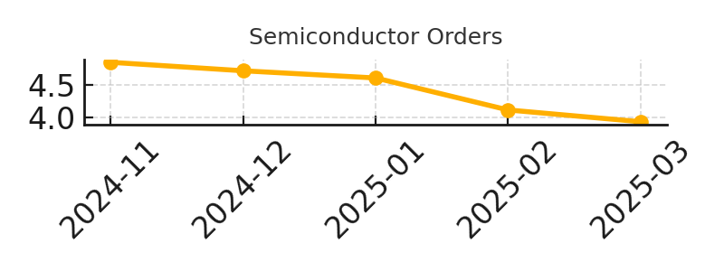
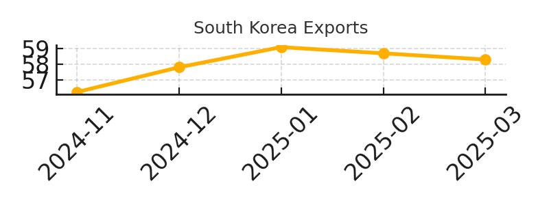
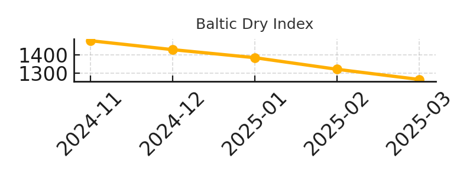
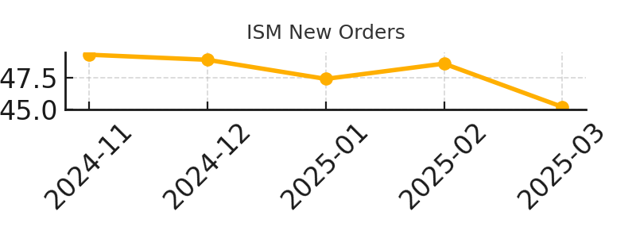

# Drift Dashboard  
*Forward indicators before the headlines catch up.*  
📅 **Snapshot: April 17, 2025**  

---

### 🧭 Semiconductor Orders  
  
- **Latest:** €3.94B (Q1 2025)  
- **Signal Strength:** 9 | **Reliability:** 9  
- **Trend:** 🔻 *Worsening*  
*Picks and shovels of global manufacturing. When chip tools stall, future production shrinks.*

---

### 🌏 South Korea Exports  
  
- **Latest:** $58.3B (March 2025)  
- **Signal Strength:** 8 | **Reliability:** 9  
- **Trend:** ↘️ *Softening*  
*SK is a trade-sensitive bellwether. Moves here front-run global flows.*

---

### ⚓ Baltic Dry Index  
  
- **Latest:** 1,263 (Apr 15, 2025)  
- **Signal Strength:** 7 | **Reliability:** 8  
- **Trend:** 🔻 *Worsening*  
*Tracks bulk materials—steel, coal, grain. Real economy churn without the ETF noise.*

---

### 🏭 ISM New Orders (U.S. PMI)  
  
- **Latest:** 45.2 (Mar 2025)  
- **Signal Strength:** 9 | **Reliability:** 9  
- **Trend:** ⚠️ *Flashing*  
*Contraction in new orders = softness coming in production and hiring.*

---

📂 [View the source repo on GitHub](https://github.com/B1G0AK/drift-dashboard)

Next update: **May 2025**
